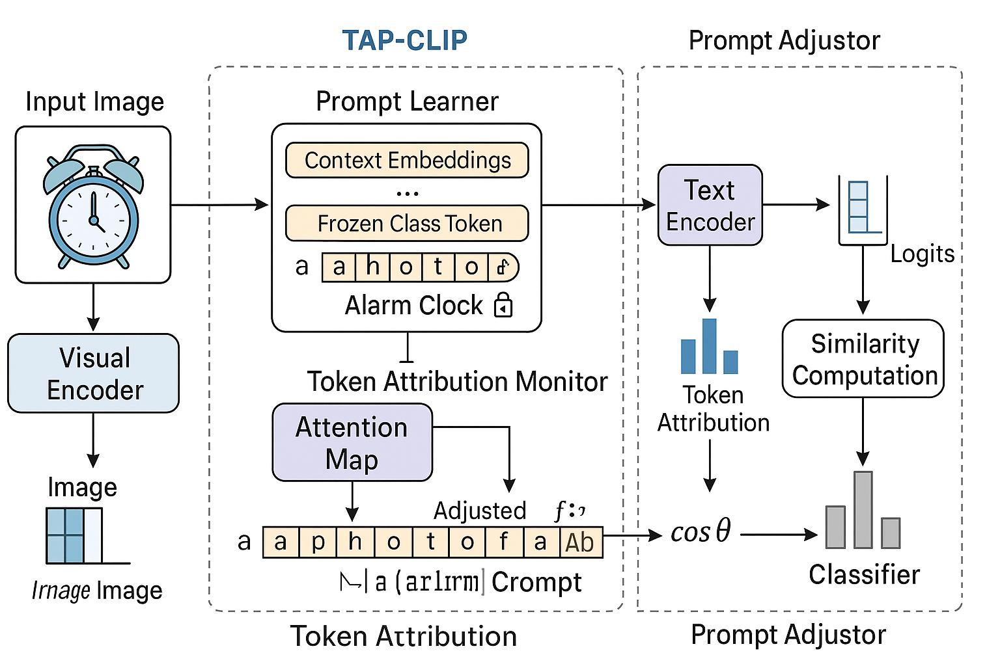

# 🧠 AttrPrompt: Token Attribution-Guided Prompt Tuning for Robust CLIP under Domain Shift

**AttrPrompt** is a dynamic prompt learning framework that leverages token attribution to adapt prompts for domain-shifted visual classification. Built on CLIP, it dynamically analyzes attention maps to enhance the alignment between visual and textual modalities, enabling better generalization to unseen domains and classes.

<p align="center">
  
</p>

## ✨ Features

- ✅ **Dynamic Prompt Adjusting** via token attribution  
- ✅ **Cross-domain Generalization** on OfficeHome & DomainNet  
- ✅ **Plug-and-Play Design** for any CLIP-compatible model  
- ✅ **Supports Seen-to-Unseen Class Transfer**  
- ✅ **Few-shot + Zero-shot Evaluation**

## 📁 Project Structure
```python
dsCLIP/  
├── models/  
│   ├── clip_wrapper.py          # CLIP model wrapper with hook  
│   ├── prompt_learner.py        # Token-aware prompt learner  
│   ├── attribution_monitor.py   # Attention-based attribution  
│   ├── prompt_adjustor.py       # Prompt adjustment module  
│   └── model_wrapper.py         # Unified model  
├── dataset.py                   # OfficeHome dataset loader  
├── train.py                     # Training script  
├── test_cross_domain.py         # Cross-domain evaluation  
├── utils/  
│   └── eval_metrics.py          # Accuracy and metric utilities  
├── Best Models/                 # Saved checkpoints  
└── visible results/             # Plots and CSV outputs
```
## 🚀 Quick Start

### 1. Install Dependencies

```bash
conda create -n dsCLIP python=3.8
conda activate dsCLIP
pip install -r requirements.txt
```
### 2. Download Dataset
Place OfficeHome or [DomainNet] datasets under data/ directory.

### 3. Train on Real-World Domain

python train.py
### 4. Evaluate Cross-Domain Transfer
```bash
python test_cross_domain.py
Results will be saved as:
CSV → visible results/cross_domain_results_*.csv
Plot → visible results/cross_domain_accuracy_bar_*.png
```
### 📈 Results (OfficeHome)
Method	Real→Clipart	Real→Art	Real→Product
CLIP (Zero)	47.2%	52.1%	58.4%
AttrPrompt	65.3%	68.0%	70.1%

(Few-shot accuracy improves further with 5/15 shots)

### 📜 Citation
Coming soon.

### 🧊 License
This project is licensed under the MIT License.

Feel free to ⭐️ this repo if you find it useful or inspiring!
